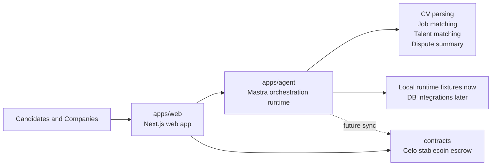
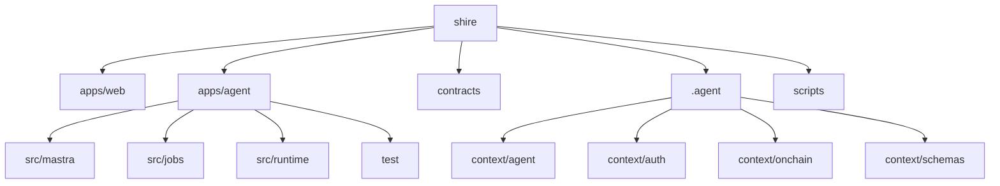

# Shire

Shire is an AI-assisted hiring marketplace monorepo built around three core surfaces:

- a public web product for candidates and companies
- an autonomous-but-guardrailed agent runtime for CV parsing, matching, and dispute support
- a smart contract layer for stablecoin-based escrow on Celo

The repository is structured for product development first, with agent context and workflow contracts kept explicit so the system stays auditable and does not drift into vague behavior.

## Why Shire

Shire is being designed to solve a narrow, practical problem:

- help candidates turn raw CV data into structured profiles
- help companies match talent with explicit scoring and traceable reasoning
- support dispute summarization and operational review
- settle marketplace flows with stablecoins on Celo instead of speculative token flows

## Architecture



## Monorepo Layout



## Current Scope

### Web

`apps/web` is the public product surface. It is currently a Next.js app inside the monorepo and is intended to become the main interface for candidate onboarding, company flows, and hiring marketplace operations.

### Agent

`apps/agent` is the orchestration runtime. It currently includes:

- domain agents for CV profile, job matching, talent matching, and dispute summary
- deterministic workflow boundaries for `extract -> normalize -> interpret`
- local fixture-backed job runners so the orchestration layer can be built before the web database exists
- guardrails for `manual`, `semi-autonomous`, and `fully-autonomous` operating modes
- structured runtime logging with `pino` and `pino-pretty`

### Contracts

`contracts` is the Solidity workspace. The current direction is stablecoin escrow on Celo. Onchain sync from the agent is intentionally deferred until the web and data flows are more mature.

### Agent Context

`.agent` contains the repository context used to keep agent behavior grounded:

- architecture and process rules
- agent workflow and orchestration docs
- auth context
- onchain context
- shared domain schemas

This is the source of truth for reducing hallucination and keeping the runtime aligned with product intent.

## Local Development

### Prerequisites

- Node.js `20+`
- npm `11+`

### Install

```bash
npm install
```

### Run the Monorepo

```bash
npm run dev
```

The root dev command starts:

- `apps/web`
- `apps/agent`

Note:

- the root dev command uses a small Node orchestrator in [`scripts/dev.mjs`](E:\web3\shire\scripts\dev.mjs) instead of Turbo for persistent dev processes on this Windows environment
- the agent runtime defaults to port `3010`
- the web app typically uses Next.js default dev behavior on port `3000`

### Build

```bash
npm run build
```

### Typecheck

```bash
npm run typecheck
```

## Agent Runtime

The agent runtime can be started on its own:

```bash
npm run dev --workspace=@shire/agent
```

The service exposes a simple health endpoint:

```text
GET /health
GET /ready
```

Default environment template:

- [apps/agent/.env.example](E:\web3\shire\apps\agent\.env.example)

Key runtime settings:

- `PORT`
- `SHIRE_AUTONOMY_MODE`
- `SHIRE_LOG_LEVEL`
- `SHIRE_PRETTY_LOGS`
- `SHIRE_MODEL`
- `OPENAI_API_KEY`

## Agent Jobs

The agent workspace includes runnable job entrypoints for isolated workflow testing:

```bash
npm run job:cv-parse --workspace=@shire/agent
npm run job:job-matching --workspace=@shire/agent
npm run job:talent-matching --workspace=@shire/agent
npm run job:dispute-summary --workspace=@shire/agent
```

Current job data comes from local runtime fixtures in:

- [apps/agent/src/runtime/data/runtime-data.ts](E:\web3\shire\apps\agent\src\runtime\data\runtime-data.ts)

That is deliberate. The repo is keeping orchestration and workflow contracts stable first, then swapping the data source to a real database later.

## Contract Development

The Solidity workspace lives in:

- [contracts](E:\web3\shire\contracts)

The current contract direction is:

- marketplace escrow
- stablecoin settlement
- Celo deployment target

This repository is not positioning onchain staking as the primary product path.

## Testing

Agent verification currently includes:

```bash
npm run test --workspace=@shire/agent
npm run build --workspace=@shire/agent
```

The agent tests cover:

- env parsing
- autonomy guardrails
- CV parsing pipeline
- runtime bootstrap
- server health behavior
- tool contracts
- workflow stability

## Roadmap

Near-term priorities:

- connect the web product to a real persistence layer
- replace agent fixture data with repository and database adapters
- wire event-driven job triggers
- add Celo onchain sync after web and data flows are stable
- refine the public product UX and marketplace flows

## Contributing

This repository is still in active build mode. Until a dedicated contributor guide is added, keep contributions aligned with these rules:

- preserve clear workspace boundaries
- keep agent behavior explicit and auditable
- prefer deterministic workflow contracts at system boundaries
- update `.agent` context when product assumptions change

## Repository Context

If you are working inside this codebase with an AI coding agent, start here:

- [.agent/README.md](E:\web3\shire\.agent\README.md)
- [.agent/context/README.md](E:\web3\shire\.agent\context\README.md)

## License

No license file is published yet in this repository.

